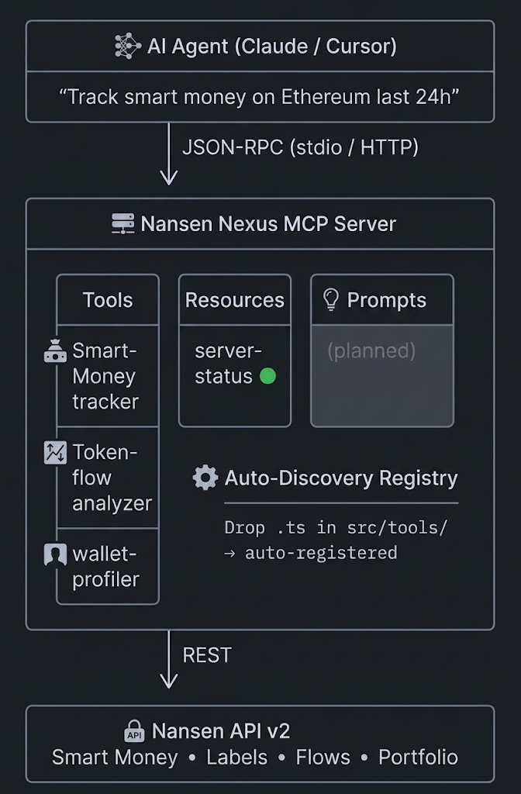

# 🧠 Nansen Nexus MCP

> **Compound Skills Router for AI Agents** — Enterprise-grade MCP server exposing Nansen on-chain intelligence as composable AI tools.

[](https://www.typescriptlang.org/)
[](https://modelcontextprotocol.io/)
[](https://nodejs.org/)

---

## 🎯 What is this?

Nansen Nexus MCP transforms Nansen's on-chain analytics into **MCP-standardized compound skills** that any AI agent (Claude, Cursor, Windsurf, etc.) can invoke via JSON-RPC.

Instead of building one-off CLI tools, Nexus exposes:
- **Smart Money Tracking** — Follow whale/fund/DAO wallets across chains
- **Token Flow Analysis** — Detect CEX inflow/outflow patterns, bridge activity
- **Wallet Profiling** — Full wallet dossier: labels, PnL, portfolio, history

All tools are auto-discovered at boot via the module registry system. **Just drop a `.ts` file in `src/tools/` and it's live.**

---

## 🏗️ Architecture



---

## 🚀 Quick Start

Choose your preferred way to run the MCP server: **Make**, **Docker**, or **Manual NPM**.

### Option A: Using `make` (Recommended)

The included `Makefile` abstracts all the setup and execution commands.

```bash
# 1. Install dependencies and create .env
make setup
# ⚠️ Edit .env and insert your NANSEN_API_KEY

# 2. Build the project
make build

# 3. Run the interactive MCP Inspector UI
make inspect

# 4. Or, run in Stdio mode (for Cursor / Claude Desktop)
make serve-stdio
```

### Option B: Using Docker

Perfect for cloud deployments (like Cloud Run) or keeping your local environment clean. The server runs on HTTP transport by default.

```bash
# 1. Create your env file
cp .env.example .env
# ⚠️ Edit .env and insert your NANSEN_API_KEY

# 2. Build and spin up the container in the background
docker compose up --build -d

# 3. View live logs
docker compose logs -f

# 4. Shut down when finished
docker compose down
```

*(Alternatively, you can just use `make docker-up` and `make docker-down`)*

### Option C: Manual NPM

For developers looking to run commands manually.

```bash
# 1. Install dependencies
npm install

# 2. Configure API key
cp .env.example .env
# ⚠️ Edit .env and insert your NANSEN_API_KEY

# 3. Build & run (stdio mode — for Claude Desktop / Cursor)
npm run build
npm run serve:stdio

# 4. Or run in HTTP mode (for remote agents)
npm run serve:http
```
### Register in Claude Desktop

Add to your `claude_desktop_config.json`:

```json
{
  "mcpServers": {
    "nansen-nexus": {
      "command": "node",
      "args": ["/path/to/NansenNexusMCP/build/index.js"]
    }
  }
}
```

---

## 🛠️ Available Tools

| Tool | Description | Key Params |
|------|-------------|------------|
| `smart-money-tracker` | Track labeled wallet movements | `chain`, `timeframe`, `entityType` |
| `token-flow-analyzer` | CEX/DEX flow analysis | `token`, `chain`, `flowType` |
| `wallet-profiler` | Full wallet dossier | `address`, `chain`, `includePnl` |

---

## 📂 Project Structure

```
src/
├── index.ts                    # Entry point
├── server/
│   └── boot.ts                 # Dual transport (stdio/HTTP) server
├── registry/
│   ├── auto-loader.ts          # Auto-discovery engine
│   ├── helpers.ts              # Module loading utilities
│   ├── module-processor.ts     # Validation & registration
│   └── types.ts                # RegisterableModule interface
├── tools/
│   ├── smart-money-tracker.ts  # Smart Money skill
│   ├── token-flow-analyzer.ts  # Token Flow skill
│   └── wallet-profiler.ts      # Wallet Profiling skill
└── resources/
    └── server-status.ts        # Server health resource
```

---

## 🧪 Development

```bash
# Type-check
npm run typecheck

# Run tests
npm test

# Interactive REPL
npm run dev

# MCP Inspector
npm run inspect

# Generate new tool
npm run gen:tool
```

---

## 🐳 Docker

```bash
# Build & run
docker compose up --build

# With API key
NANSEN_API_KEY=your_key docker compose up --build
```

---

## 📄 License

MIT — Built by [@edycutjong](https://github.com/edycutjong) for the Nansen ecosystem.
